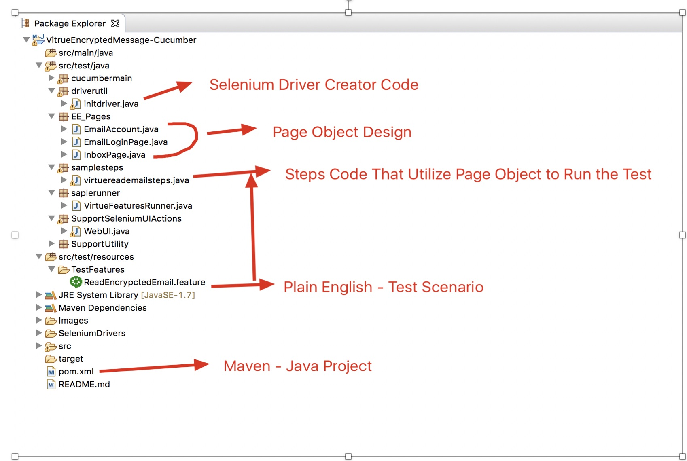
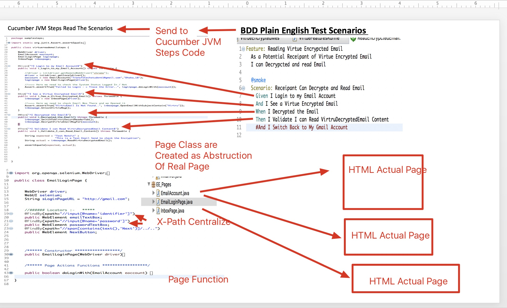

# Virtru Encrypted Message Reading Automation Script

# Introduction
This is simple assignment project to Demonstrate a Automation - reading  a Secure Encrypted email from  Virtru platform
This Project contains a BDD based cucumber Java Script to make it more easy to understand 

## Technology Stack
The entire framework was built using latest and greatest open source tools and technology 

- [x] [Cucumber](https://cucumber.io/) => for batter functional ACCEPTANCE test. 
- [x] [Gherkin Syntax](https://docs.cucumber.io/gherkin/) =+> to make the test living documentation for the entire team
- [x] [Java/JDK](http://www.oracle.com/technetwork/java/javase/downloads/jdk8-downloads-2133151.html) ==> to use the power of Object Oriented Programming, Page object Model Design Pattern
- [x] [Selenium](https://www.seleniumhq.org/) ==> for web browser based application. 
- [x] [Maven](https://maven.apache.org/plugins/maven-compiler-plugin/) ==> for Build & deployment with Depedency management

### Installing & Executing the Program

* Clone the git-hub repo to any machine that has maven installed
* Open terminal in mac or CMD in windows
* CD to the project Directory
* run this below command to start the program
* mvn clean verify

## Running From Eclipse

* Also We can Clone the Repo in Eclipse
* Then Right click the POM.XML file and
* Select Run - > Run As maven mvn clean verify

Or Simply Expand the src/test/java/saplerunner Package 
   And Run the VirtueFeaturesRunner.java file as a Junit test 
   
## Report Can be Found in target Directory 
   
   